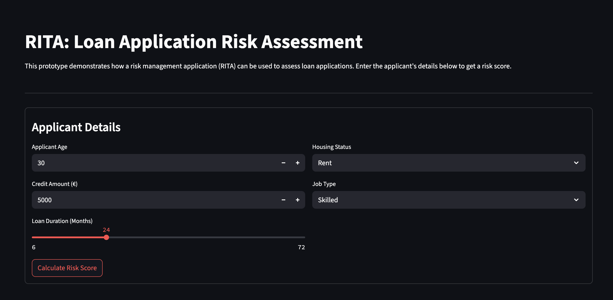
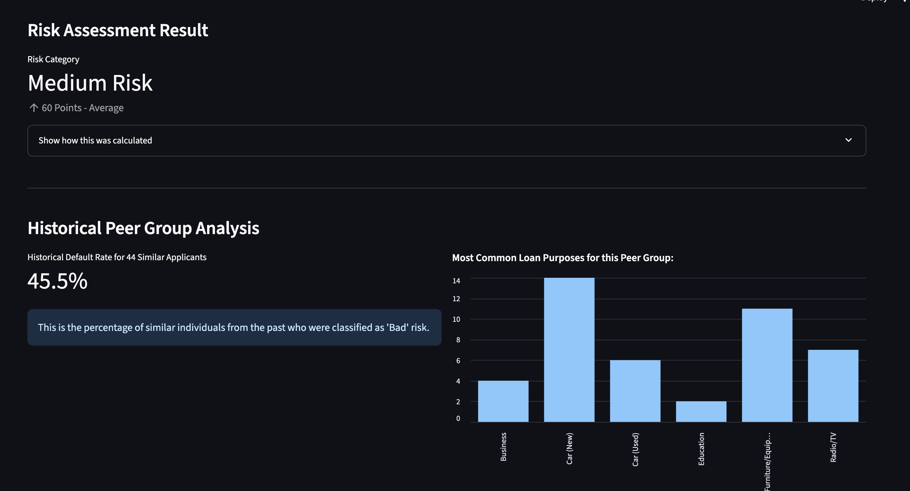

# RITA Prototype: Advanced Risk Decision Support System

## 1. Overview

This project is a functional prototype of an advanced decision-support system for credit risk analysis, nicknamed "RITA" (Risk-Informed Triage Application). It is designed to showcase a range of professional software development practices, including robust back-end engineering, data-driven analysis, and a clean, interactive user interface.

The application allows a user to perform a risk assessment for a loan applicant and receive not only a score but also deep, data-driven context from historical data. The entire system is built to be flexible, maintainable, and verifiable through automated testing.

---

## 2. Core Features

This prototype is built around three key pillars that demonstrate a separation of concerns and a mature approach to software design.

### a. Interactive Risk Calculator
The core user-facing feature is a simple, intuitive UI built with Streamlit. It allows an analyst to input applicant details and receive an immediate risk assessment.

*   **Transparency:** A key feature is the ability to see a step-by-step breakdown of how the risk score was calculated, making the model's logic transparent and understandable.

### b. Data-Driven Peer Group Analysis
To enrich the decision-making process, the application automatically compares the applicant to a "peer group" from a historical dataset (`german.data`).

*   **Contextual Insights:** It calculates and displays the historical default rate for this peer group and visualizes their most common loan purposes. This provides valuable, data-driven context that goes beyond a simple score.

### c. Configurable Rule Engine
The business logic is fully decoupled from the application code. The risk assessment rules (e.g., points for age, credit amount) are defined in an external `config/rules.json` file.

*   **Flexibility & Maintainability:** This design allows business analysts or system administrators to modify the risk model's logic without requiring any changes to the Python source code, reflecting a professional, enterprise-ready architecture.

---

## 3. System Architecture & Design

The project is organized to promote modularity and testability.

*   `src/`: Contains the core Python source code.
    *   `app.py`: The main Streamlit application (UI Layer).
    *   `risk_model.py`: The generic, configuration-driven rule engine (Business Logic Layer).
    *   `data_processing.py`: Handles loading, cleaning, and analyzing the historical dataset (Data Access Layer).
*   `config/`: Contains external configuration files.
    *   `rules.json`: Defines the business logic for the risk model.
*   `data/`: Contains the raw historical data.
*   `tests/`: Contains the automated test suite.
    *   `test_risk_model.py`: Unit tests for the rule engine.
    *   `test_data_processing.py`: Unit tests for the data loading and cleaning logic.

---

## 4. Project Blueprint: Setup and Execution

Follow these steps to set up and run the project locally.

### a. Prerequisites
*   Python 3.9+
*   `git` for cloning the repository.

### b. Step 1: Clone the Repository
```bash
git clone <your-repository-url>
cd credit_risk_analysis_prototype
```

### c. Step 2: Create and Activate a Virtual Environment
It is critical to use a virtual environment to isolate project dependencies.

```bash
# Create the virtual environment
python3 -m venv .venv

# Activate it (on macOS/Linux)
source .venv/bin/activate
```

### d. Step 3: Install Dependencies
The required Python packages are listed in `requirements.txt`.
```bash
pip install -r requirements.txt
```

### e. Step 4: Run the Automated Tests (Optional but Recommended)
Before launching the application, you can verify that the core logic is working correctly by running the test suite using `pytest`.

```bash
pytest
```
You should see all tests passing, confirming the system's integrity.

### f. Step 5: Launch the Application
Use the provided shell script to run the Streamlit application.

```bash
./run_app.sh
```
The application will open in your default web browser.

---

## 5. Application Screenshots

*(Note: These are placeholders. Please run the application and replace the `src` path with your own screenshots.)*

### a. Main Interface with Risk Assessment
This view shows the primary input form and the resulting risk score, including the transparent explanation of the calculation.



### b. Peer Group Analysis View
This view shows the data-driven context provided after a calculation, including the historical default rate and loan purposes for similar applicants.


